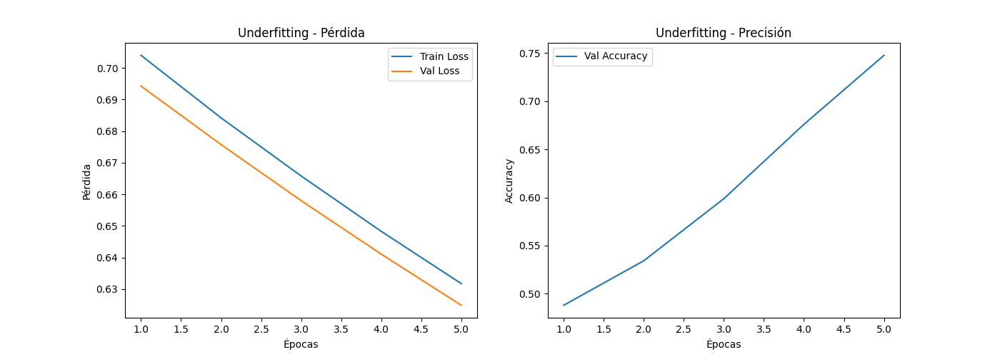
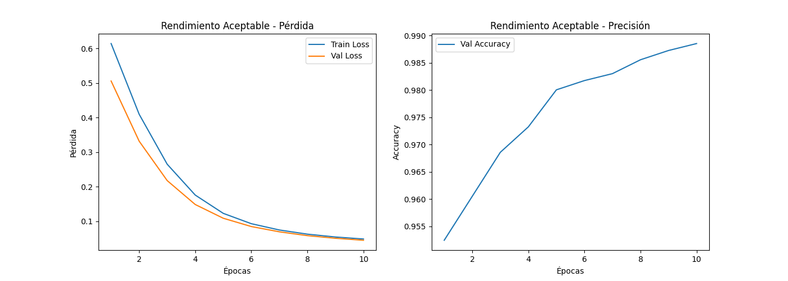
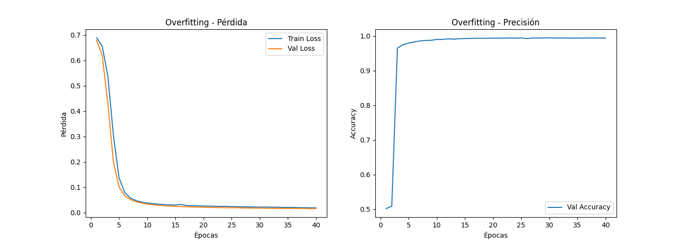

# ¡Comentario!: Me falta terminar de agregar archivos y funcionalidad al repo, es una prueba para lograr un ejemplo de repositorio organizado... y comenzar a entender como utilizar y aprovechar github"

# TP1 - MLP en PyTorch | Aprendizaje Automático 2

Este trabajo práctico implementa una red neuronal multicapa (MLP) usando PyTorch para clasificar dígitos del conjunto de datos MNIST. Se exploran distintos escenarios de entrenamiento: **underfitting**, **buen rendimiento** y **overfitting**, ajustando los hiperparámetros del modelo y evaluando los resultados mediante métricas y visualizaciones.

## 📁 Estructura del Proyecto


## 🚀 Tecnologías Utilizadas

- Python 3.x
- PyTorch
- NumPy
- Matplotlib
- Jupyter Notebook

## 🧠 Objetivos

- Implementar una red MLP para clasificación binaria (dígitos 0 vs 8).
- Analizar el comportamiento del modelo en distintos escenarios:
  - Subajuste (underfitting)
  - Buen ajuste
  - Sobreajuste (overfitting)
- Visualizar la evolución del error y la precisión durante el entrenamiento.

## 📊 Resultados

A continuación se muestran los gráficos de pérdida y precisión durante el entrenamiento en tres escenarios distintos: underfitting, rendimiento aceptable y overfitting.

---

### 🔹 Underfitting


---

### 🔹 Rendimiento Aceptable


---

### 🔹 Overfitting



## 🧪 Cómo Ejecutar el Proyecto

1. Clona el repositorio:
   ```bash
   git clone https://github.com/TanoMDG/Aprendizaje-automatico-2.git
   cd Aprendizaje-automatico-2
   
2. Crea un entorno virtual (opcional pero recomendado):
   ```bash
   python -m venv venv
   source venv/bin/activate  # En Windows: venv\Scripts\activate

3. Instala las dependencias:
   ```bash
   pip install -r requirements.txt

4. Abre el notebook:
   ```bash
   jupyter notebook

## 🧹 Por Hacer

- Modularizar el código en scripts de entrenamiento y visualización.

- Aplicar técnicas de regularización (Dropout, L2).

- Probar con más dígitos o modelos más complejos (CNNs).

## 📌 Autor

- TanoMDG
- Aprendizaje Automático 2 - 2025
   

